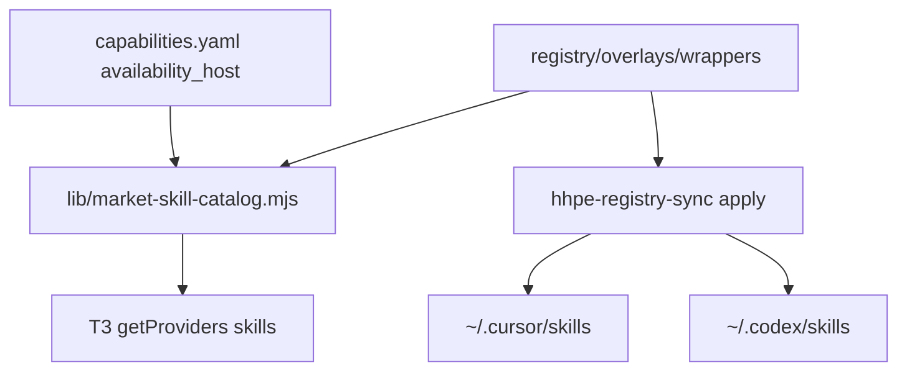

# Market input-output control plane - Plan

## Goal Capsule

**Objective.** Curated Market is the single control plane for skills: hosts write created skills to output; Market ingests output and vendor builtins; every looker, including T3 `$`, reads only Market input. `$` shows the full catalog. `owner:skill` is a warning derived from Market metadata, not a second catalog.

**Product authority.** Product Contract below. Host-native trees (`~/.codex/skills`, `.system`, skill-pool, create-skill drop folders) are not live catalogs.

**Open blockers.** None.

**Stop.** Do not ship a Market MCP server, OpenHands runtime adapter, or output ingest cron in this increment. Do not wrap T3 `cursor.json` as the `$` remedy.

**Execution.** Test-first on catalog, metadata validation, and `$` display/search cases (AE1–AE5). Smoke that T3 provider snapshots expose the catalog, not a Codex home walk.

**Tail.** `ce-work` against this file.

**Product Contract preservation.** Unchanged R/A/F/AE IDs and body. Outstanding Questions that were deferred to planning are answered in the Planning Contract.

## Product Contract

### Summary

Detach skill **creation** (output) from skill **availability** (input). Market eats output and publishes input for Cursor, Codex, Claude, T3, and later hosts. `$` lists the whole input catalog. Host-bound skills display as `Codex:name` (and the same pattern for other hosts) from a Market metadata field. Market-native skills stay unlabeled. Ports are classified one by one in that field. Architecture reserves injection points so OpenHands and a Caveman-like Market MCP can persist and serve skills later without changing this split.

### Problem Frame

T3 `$` was treated as a Cursor-cache bug. It was a looker bound to Codex’s write-side tree: `$origi` matched `caveman-compress` descriptions, `$skil` showed Codex `.system` `skill-creator` rather than Market `skill-creator-guidance`, `$guidance` showed Serena and Context7 (present under `~/.codex/skills`) and not unlabeled Market overlays that live only as Market input. Wrapping T3 Cursor snapshots could not change that list. Duplicate `caveman-compress` rows were two write-side copies of one skill, not one Market identity.

### Key Decisions

**One catalog, two pipes.** Output is where hosts create skills. Input is what lookers load. Lookers never eat output. Market never requires a human to copy a new skill into input.

**`$` is unfiltered Market input.** Selected model does not hide skills. Labels warn; they do not partition the menu into per-host catalogs.

**`owner:skill` is derived, not renamed.** Market metadata records `host: Codex` (or Cursor, Claude, T3) versus `host: any`. `$` shows `Codex:computer-use` when host-bound. Market-native skills have no prefix. Ports (Serena, Context7, and the rest) are classified individually: host-bound get a prefix; pragmatic ports look like Market-native skills.

**Host means provider surface.** Codex, Cursor, Claude, T3 — not the client device.

**Market is the live store, not only a drop box.** Collection from output remains required. Persistence (retrieve and keep skills through Market, including a future MCP analogous to Caveman) is in-identity so hosts do not keep a private live tree.

**Future hosts attach at named injection points.** OpenHands is a first-class future host (creator and looker) on the same input/output split. A Market MCP is a future persistence and serve surface. Neither is this increment’s ship; both must be attachable without a second catalog.

### Actors

- A1. Skill creator — Cursor, Codex, Claude, T3, later OpenHands. Writes only to output.
- A2. Curated Market — ingest, classify host-bound vs pragmatic, publish input, persist identity.
- A3. Skill looker — host runtimes and T3 `$`. Reads only input.
- A4. Operator — classifies ports in Market metadata; does not hand-copy trees for availability.

Lookers have no edge back to output.

### Key Flows

- F1. **Create.** A host writes a new skill to output. Market pulls it without a human copy step and publishes it on input as unlabeled unless metadata says host-bound.
- F2. **Port builtin.** A vendor builtin (for example Codex `.system` computer-use) is ingested, labeled host-bound in metadata, and appears in `$` as `Codex:name`. The `.system` tree is no longer the looker source.
- F3. **Classify a port.** An operator sets metadata on Serena, Context7, or similar to `host: any` or a specific host. `$` label follows that field. The skill `name` does not change.
- F4. **Look up.** `$` or a host skill loader lists Market input. Query `origi` can match unlabeled `original-source-research` by name. It does not depend on Cursor cache injectors.

### Requirements

**Pipes**

- R1. Hosts write created skills only to output.
- R2. Lookers, including T3 `$`, read skills only from Market input.
- R3. Market is the only consumer of output for availability.
- R4. Input projections exist per host (Cursor, Codex, Claude, T3, later OpenHands) and all project the same Market catalog.

**`$` menu**

- R5. `$` lists the full Market input catalog regardless of selected model.
- R6. Host-bound skills display as `owner:skill` using the metadata host (for example `Codex:computer-use`).
- R7. Market-native skills display the skill name with no owner prefix.
- R8. `$` search matches skill name and, for host-bound rows, the displayed `owner:skill` string.

**Metadata**

- R9. Market stores a host field: a specific host or `any`.
- R10. `$` owner prefix is derived from that field. Case-by-case port decisions are ingest edits, not renames.
- R11. Ports of existing skills (Serena, Context7, and others) are classified one by one as host-bound or pragmatic.

**Persistence and injection points**

- R12. Market identity of a skill survives beyond a collection-point copy: the control plane can persist and retrieve skills the way Caveman persists artifacts, not only index files on disk.
- R13. The architecture defines an injection point for a Market MCP that serves persist and retrieve without hosts reading output.
- R14. The architecture defines an injection point for OpenHands as a creator and looker on the same pipes.
- R15. Shipping the MCP or OpenHands adapter is later work. This increment must not make either require a second catalog or a looker on output.

### Acceptance Examples

- AE1. **When** Grok 4.6 is selected and the user types `$origi` and `original-source-research` is on Market input, **then** that unlabeled skill appears. **Covers R2, R5, R7, R8.**
- AE2. **When** the user types `$skil`, **then** Codex builtin `skill-creator` appears as `Codex:skill-creator` if metadata marks it Codex-bound, and Market `skill-creator-guidance` appears unlabeled if it is Market-native. **Covers R6, R7, R10.**
- AE3. **When** `$guidance` is typed, **then** pragmatic ports such as Serena and Context7 appear unlabeled if classified `any`, and `skill-creator-guidance` appears if it is on input. **Covers R5, R11.**
- AE4. **When** a host-bound Codex computer-use skill is on input, **then** `$` shows `Codex:…` and the skill remains listed even if Cursor is selected. **Covers R5, R6.**
- AE5. **When** a creator writes a skill to output, **then** availability on `$` happens only after Market ingest onto input, never by the looker watching the drop folder. **Covers R1, R2, R3.**

### Success Criteria

- `$origi` no longer depends on T3 Cursor cache wrapping.
- Operators change host-bound vs pragmatic by editing Market metadata, not by renaming skills or chasing four host trees.
- A later OpenHands or Market MCP integration can attach at the named injection points without redesigning input vs output.

### Scope Boundaries

**In this product’s identity**

- Input vs output split, `$` catalog and labels, metadata-driven owner prefix, port classification, reserved MCP and OpenHands injection points.

**Deferred for later**

- Implementing the Market MCP.
- Implementing the OpenHands host adapter.
- Ingest transport (cron, curl, or equivalent) and exact drop-folder layout.
- Codex `.system` builtin ingest as `availability_host: codex` (AE2/AE4).

**Outside this increment**

- Further T3 `cursor.json` / `getProviders` wrapping as the remedy for `$origi`.
- Treating the T3 client device as a host distinct from the T3 provider.

### Assumptions

- Caveman’s MCP is the persistence analogy (store and retrieve through a service), not a requirement to reuse Caveman’s compression format.
- OpenHands is already named as a paddock/control-plane host in `docs/architecture.md`; this contract treats it as a future looker/creator on Market input/output, not a competing catalog.

### Outstanding Questions

None remaining as product blockers. Planning answers for metadata field, T3 rebind, and injection stubs are in the Planning Contract.

### Sources

- Observed `$` behavior: `$origi` → duplicate `caveman-compress`; `$skil` → Codex `.system` `skill-creator` / `skill-installer`; `$guidance` → Serena and Context7, not `skill-creator-guidance`.
- Codex looker tree vs Market-only overlays: Serena/Context7 present under host Codex skills; `original-source-research` and `skill-creator-guidance` Market-linked on Cursor/OpenCode/`.agents` only; Codex exposures for those two were still planned.
- `docs/architecture.md` — OpenHands as paddock/control plane; overlays as HHPE-owned wrappers.

## Planning Contract

### Key Technical Decisions

**KTD1. Capability field `availability_host`.** Store `any` | `codex` | `cursor` | `claude` | `t3` | `openhands` on each skill capability in `registry/manifests/capabilities.yaml`. Missing field means `any` so existing rows do not all fail validate on day one. `$` prefix is `Codex:` / `cursor:` / `claude:` / `t3:` / `openhands:` from that value. Skill `name` / `display_name` stay unprefixed. Rationale: R9–R10; ingest edits the field, not the name.

**KTD2. One catalog module owns T3 `$`.** `lib/market-skill-catalog.mjs` lists Market skills (overlays plus classified capabilities) unique by `capability_id` / skill `name`. T3 `getProviders` attaches **that same array to every provider**. It does not walk `~/.codex/skills`, `.system`, or `~/.hhpe-skill-pool`, and it does not treat `cursor.json` as the source of truth. Rationale: R2, R5; observed `$` was a Codex home walk.

**KTD3. Host projections remain skill-symlinks into overlays.** Cursor, OpenCode, Claude, and Codex **native CLI** input is still `hhpe-registry-sync --apply` linking canonical overlay (or package) trees. Codex overlay skills that are `planned` `native-plugin` today (`original-source-research`, `skill-creator-guidance`, and the other hhpe-overlay Codex rows) become **active `skill-symlink`** to `~/.codex/skills/<dir>` pointing at Market overlays — not skill-pool copies. Rationale: R4; Codex CLI still needs a projection; T3 must not use that tree as the catalog.

**KTD4. Port defaults this increment.** `hhpe-hrg/serena-guidance`, `hhpe-hrg/context7-guidance`, `hhpe-hrg/playwright-guidance`, `hhpe-hrg/session-start` → `availability_host: any`. Overlay-authored `original-source-research` and `skill-creator-guidance` → `any`. Codex `.system` builtins are **not** copied into `$` until ingested as capabilities with `availability_host: codex`. Rationale: R11, user default; AE2’s `Codex:skill-creator` waits on ingest (U5 stub + follow-up).

**KTD5. Injection points are modules and adapter stubs, not servers.** `lib/market-mcp-contract.mjs` documents persist/retrieve operations without implementing transport. `registry/adapters/openhands/` is a planned adapter (relationship added when validate allows) plus README. `docs/architecture.md` names output vs input and these hooks. Rationale: R13–R15.

**KTD6. Output ingest is a reserved hook only.** `lib/registry.mjs` (or a sibling) exports a no-op/documented `discoverSkillOutput` seam. No cron. Rationale: deferred ingest; F1/AE5 still true because lookers do not watch a drop folder.

**KTD7. Unique by Market name, not folder basename.** Two roots that both YAML-name `caveman-compress` become one catalog row. Rationale: duplicate `$` rows.

**Product Contract preservation.** Unchanged.

### High-Level Technical Design

T3 `$` reads `catalog`. Host CLIs read projections. Neither reads `.system` or skill-pool as authority.

### Assumptions

- Packaged T3 still loads `lib/t3-cursor-skills.mjs` wraps; those wraps switch from Cursor-FS discovery to the Market catalog.
- Adding `codex|skill-symlink` rows for overlays does not remove the marketplace plugin copy used by Codex plugins; CLI home links are the Codex **looker** projection.
- Default `any` on missing `availability_host` is temporary compatibility; new capabilities must set the field.

### Sequencing

U1 → U2 → U3 and U5 in parallel after U1 → U4 (needs U2) → U6. Tests land with each unit.

### Implementation constraints

- Follow `validateExposureDeclarations` relationship allow-list in `lib/registry.mjs`.
- Tests: `node --test tests/*.test.mjs` as in `package.json`.
- No absolute paths in new docs; no `skills-cursor` targets.

## Implementation Units

### U1. Capability `availability_host` metadata

**Goal:** Skill capabilities carry host-bound vs `any`; validate rejects unknown values.

**Requirements:** R9, R10, R11

**Dependencies:** none

**Files:** `registry/manifests/capabilities.yaml`, `lib/registry.mjs`, `tests/capability-host-metadata.test.mjs`, `scripts/generate-manifests.mjs` if it emits capabilities

**Approach:** Add `availability_host` with the enum in KTD1. Validate in `validate` / capability checks. Default missing to `any`. Do not rename `display_name`.

**Patterns to follow:** `validateExposureDeclarations` in `lib/registry.mjs`; `tests/cursor-realization.test.mjs` style assertions

**Test scenarios:**
- Happy: capability with `availability_host: any` validates
- Happy: `codex` validates
- Error: `laptop` fails validate
- Edge: omitted field treated as `any`

**Verification:** `node --test tests/capability-host-metadata.test.mjs` and `npm test` validate path still passes on the repo manifests after defaults

### U2. Market skill catalog publisher

**Goal:** One function returns the T3 `$` skill array: name, path, enabled, description, `displayName` from metadata.

**Requirements:** R2, R5, R6, R7, R8, KTD2, KTD7

**Dependencies:** U1

**Files:** `lib/market-skill-catalog.mjs`, `tests/market-skill-catalog.test.mjs`

**Approach:** Read capabilities of `type: skill` plus overlay wrappers. Unique by skill `name`. `displayName` = prefixed only when `availability_host` is not `any`. Description from SKILL.md frontmatter. Path is canonical overlay or package skill directory `SKILL.md`.

**Execution note:** Implement catalog tests first (name unique, prefix, orig present, compress once).

**Patterns to follow:** `discoverCursorSkillsSync` frontmatter parse in `lib/t3-cursor-skills.mjs` without using Cursor home as the source list

**Test scenarios:**
- Covers AE1. Catalog includes `original-source-research` unlabeled
- Covers AE3. Serena/Context7 unlabeled when `any`
- Duplicate YAML names collapse to one row
- Host-bound fixture displays `Codex:computer-use` and name remains `computer-use`
- Covers R8. Search helper matches `origi` on name `original-source-research` and matches `Codex:comp` on prefixed displayName

**Verification:** unit tests only; no T3 process required

### U3. Codex (and peer) input projections for Market overlays

**Goal:** Codex home skills that Market owns are symlinks to overlays, including orig and skill-creator-guidance.

**Requirements:** R4, KTD3

**Dependencies:** U1

**Files:** `registry/manifests/exposures.yaml`, `lib/registry.mjs` if relationship tweaks needed, `tests/sync.test.mjs` or `tests/sync-adapters.test.mjs`, `scripts/generate-manifests.mjs` so regenerate does not restore `planned` `native-plugin` for those overlay rows

**Approach:** For hhpe-overlay skills, Codex exposure `status: active`, `mode: skill-symlink`, `target: ~/.codex/skills/<dir>`, source overlay wrapper. Keep Cursor/OpenCode/agents links as today. Do not point T3 catalog at these homes.

**Patterns to follow:** existing cursor `skill-symlink` exposures; `sync({apply})` in `lib/registry.mjs`

**Test scenarios:**
- Sync plan includes orig → `~/.codex/skills/original-source-research`
- Generate-manifests does not revert those rows to planned native-plugin
- Unsafe targets still rejected

**Verification:** `node lib/registry.mjs validate`; sync dry-run lists the new links

### U4. Bind T3 `$` to the Market catalog

**Goal:** Every T3 provider snapshot’s `skills` is the Market catalog, unique, no Codex `.system` walk.

**Requirements:** R2, R5, R7, AE1, KTD2

**Dependencies:** U2

**Files:** `lib/t3-cursor-skills.mjs`, `lib/t3-cursor-skills-loader.mjs` if needed, `tests/t3-cursor-skills.test.mjs`

**Approach:** Replace attach-from-`~/.cursor/skills` / OpenCode merge with `attachMarketCatalogToProviders`: all providers get `catalog` skills and matching slash commands. Persist wrap still allowed so disk snapshots match live `$`, but disk is a cache of the catalog, not the authority. Stop treating Cursor-only attach as the product.

**Patterns to follow:** existing `attachCursorSkillsToProviders` / `writeProviderStatusCache` needles; tests in `tests/t3-cursor-skills.test.mjs`

**Test scenarios:**
- Covers AE1. Attached Cursor and OpenCode both contain unlabeled orig
- Two providers share one uniqued list (no double compress)
- Codex `.system` skill-creator is absent until U5 ingest exists
- Transform still wraps getProviders and persist

**Verification:** `node --test tests/t3-cursor-skills.test.mjs tests/market-skill-catalog.test.mjs`

### U5. Classify pragmatic ports; stub builtin ingest

**Goal:** Serena, Context7, playwright-guidance, session-start, orig, skill-creator-guidance set `availability_host: any`. Document that Codex `.system` builtins enter only via future ingest with `codex`.

**Requirements:** R11, R15, AE3, KTD4

**Dependencies:** U1

**Files:** `registry/manifests/capabilities.yaml`, `docs/adding-a-skill.md` (one paragraph on `availability_host`), `docs/architecture.md` (builtin ingest is Market-only)

**Approach:** Set fields on named capabilities. Do not copy `.system` into overlays this increment. AE2 `Codex:skill-creator` remains a follow-up ingest unit outside this increment’s DoD except as a documented gap.

**Test expectation:** none beyond U1 validate on updated YAML — classification is data

**Verification:** grep/capabilities validate; catalog test fixtures match `any` for those ids

### U6. MCP and OpenHands injection stubs

**Goal:** Named seams so later persist-MCP and OpenHands do not invent a second catalog.

**Requirements:** R12, R13, R14, R15, KTD5, KTD6

**Dependencies:** U2

**Files:** `lib/market-mcp-contract.mjs`, `lib/skill-output-hook.mjs` (or exports on `registry.mjs`), `registry/adapters/openhands/README.md`, `docs/architecture.md`

**Approach:** Contract module lists persist/retrieve/list operations and states they must use Market identity. Output hook comments that lookers must not call it. OpenHands README: planned host, same input/output split. No HTTP MCP server.

**Patterns to follow:** `registry/adapters/cursor/adapter.json` as a thin adapter descriptor

**Test scenarios:**
- Contract module exports a frozen operation list (list/persist/retrieve)
- Output hook is documented no-op in tests (does not scan a drop folder into `$`)

**Verification:** `node --test` on a small contract test; architecture doc mentions both injection points

## Verification Contract

- `node --test tests/capability-host-metadata.test.mjs tests/market-skill-catalog.test.mjs tests/t3-cursor-skills.test.mjs`
- `npm test` in the curated-market repo (existing `tests/*.test.mjs`)
- `node lib/registry.mjs validate`
- `node scripts/sync-adapters.mjs check` if U3 touches adapter generation
- Manual: T3 `$origi` shows unlabeled `original-source-research`; `$guidance` shows unlabeled Serena/Context7 and `skill-creator-guidance`; `$` does not list two identical `caveman-compress` rows from two homes

## Definition of Done

- U1–U6 merged with tests green as above
- Product AE1 and AE3 hold on a live T3 `$` against this host
- AE2 Codex builtin prefix is documented as blocked on ingest, not faked from `.system`
- No MCP server or OpenHands runtime in the diff
- Abandoned t3-cursor-skills experiments that still teach `$` to eat Cursor-FS or Codex-FS as authority are removed or inverted to catalog-only
- Dead-end injector comments that claim Cursor cache wrap is the `$` fix are updated to point at the catalog module

## Risks and system-wide impact

- **T3 `$` list shrinks** to Market-known skills until more capabilities are ingested. That is the product, not a regression.
- **Codex CLI vs T3:** CLI still uses `~/.codex/skills` projections; T3 must not fall back to that walk if a wrap fails — fail closed to catalog or empty, never `.system`.
- **generate-manifests** can wipe exposure edits; U3 must change the generator.
- Cross-host: Cursor/OpenCode links already exist; Codex was the hole for orig.

## Alternatives considered

- **Only symlink orig into `~/.codex/skills` and leave T3 walking Codex home.** Faster AE1, but `$` still eats write-side trees and `.system` builtins leak. Rejected per KTD2.
- **Keep Cursor-cache wrap as `$` source.** Contradicts observed Grok 4.6 `$` and R2. Rejected.

## Deferred to follow-up work

- Output folder + curl/cron ingest (KTD6 seam only now)
- Ingest Codex `.system` as `availability_host: codex` (AE2/AE4)
- Market MCP server (Caveman-like persist)
- OpenHands adapter implementation
- Per-port classification of remaining skill-pool copies
